## Deskripsi Aplikasi Web
Anak Ayam Dorayaki Shop merupakan sebuah website yang dibentuk untuk membantu Doremonangis menjalankan bisnisnya. Website ini dapat diakses oleh 2 jenis pengguna, yaitu Admin dan Pembeli. Seluruh pengguna harus melakukan autentikasi terlebih dahulu agar dapat mengakses fitur lainnya. Admin dapat melakukan pengelolaan varian, manajemen stok, serta melihat riwayat perubahan dorayakki. Sedangkan pembeli dapat melihat daftar varian, melakukan pembelian, serta melihat riwayat pembelian dorayaki olehnya. Kedua jenis pengguna dapat mencari suatu varian dorayaki berdasarkan keyword.


## Daftar Requirement
Untuk menjalankan website Anak Ayam Dorayaki Shop, pastikan perangkat Anda dapat mengakses:
1. HTML 5
2. PHP
3. XAMPP
4. Docker Desktop

## Cara Instalasi
1. Install XAMPP

atau

2. Install Docker

## Cara Menjalankan Aplikasi
1. Pada saat pertama kali menjalankan aplikasi, Anda akan langsung diarahkan pada halaman "Login".
2. Jika Anda telah memiliki akun, isi setiap kolom pada halam "Login" kemudian tekan tombol "Login". Jika sudah berhasil login, Anda akan langsung diarahkan ke halaman dashboard.
3. Jika Anda belum memiliki akun, Anda dapat menekan tulisan "Daftar" untuk membuat akun. Kemudian Anda akan diarahkan pada halaman "Sign Up".
4. Isi setiap kolom pada halaman "Sign Up", kemudian tekan tombol "Daftar". Jika sudah berhasil signup, Anda akan langsung diarahkan ke halaman dashboard.
5. Pada navbar Pembeli, terdapat menu Home (menuju dashboard), Riwayat (menuju riwayat pembelian pengguna), Logout(logout aplikasi dan kembali ke halaman login), dan Search Bar (menuju halaman pencarian).
6. Pada navbar Admin, terdapat menu Home (menuju dashboard), Riwayat (menuju riwayat perubahaan), Tambah Varian (menuju halaman penambahan varian baru), Logout(logout aplikasi dan kembali ke halaman login), dan Search Bar (menuju halaman pencarian).
7. Pada dashboard akan ditampilkan 8 varian dorayaki yang terurut berdasarkan jumlah terjualnya. Untuk melihat detail varial, Anda dapat menekan gambar atau nama varian dorayaki.
8. Pada halaman detail Pembeli, terdapat tombol "Beli" yang akan mengarahkan ke halaman "Pembelian".
9. Pada halaman detail Admin, terdapat tombol "Edit" yang akan mengarahkan ke halamanan "Ubah Varian", tombol "Ubah Stok" yang akan mengarahkan ke halamanan "Perubahan Stok", dan tombol "Delete" yang akan menghapus jenis varian dorayaki yang tertera pada halaman "Detail".
10. Setelah menekan tombol "Delete", akan muncul pop-up konfirmasi. Tekan "OK" jika Anda ingin menghapus varian. Jika sudah berhasil, akan muncul pop-up pesan sukses menghapus dan Anda akan langsung diarahkan menuju dashboard.
11. Untuk melakukan pencarian suatu varian berdasarkan nama, Anda dapat memasukkan keyword pencarian pada search bar. Kemudian Anda akan diarahkan ke halaman "Pencarian".
12. Pada halaman Tambah Varian, pastikan nama gambar tidak mengandung spasi


## Cara Menjalankan Server
1. Clone repository ini pada direktori
> C:\xampp\htdocs\
2. Buka aplikasi XAMPP
3. Klik start pada bagian Apache
4. Pada browser favorit Anda, masukkan link berikut
```
http://localhost/tubes-1-anak-ayam/login.php
```

atau jika dijalankan menggunakan docker

1. Buka docker desktop
2. Pastikan sudah login dan docker engine running
3. Clone repository ini pada folder favorit Anda
4. Buka command prompt pada folder "docker" di repository ini
5. Jalankan perintah berikut
> docker build -t docker-anak-ayam .

> docker-compose up -d
6. Pindahkan semua file dan folder di repository ini (kecuali folder docker) ke dalam folder docker/development
7. Pada browser favorit Anda masukkan link berikut
```
http://localhost:5000/login.php
```

## Screenshot Tampilan Aplikasi 
**Login**
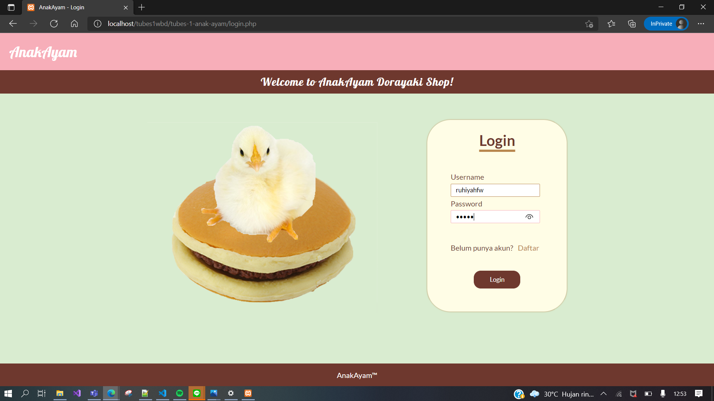

**Register**
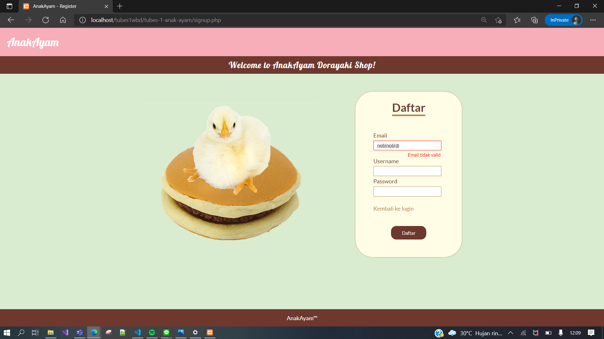

**Dashboard admin**
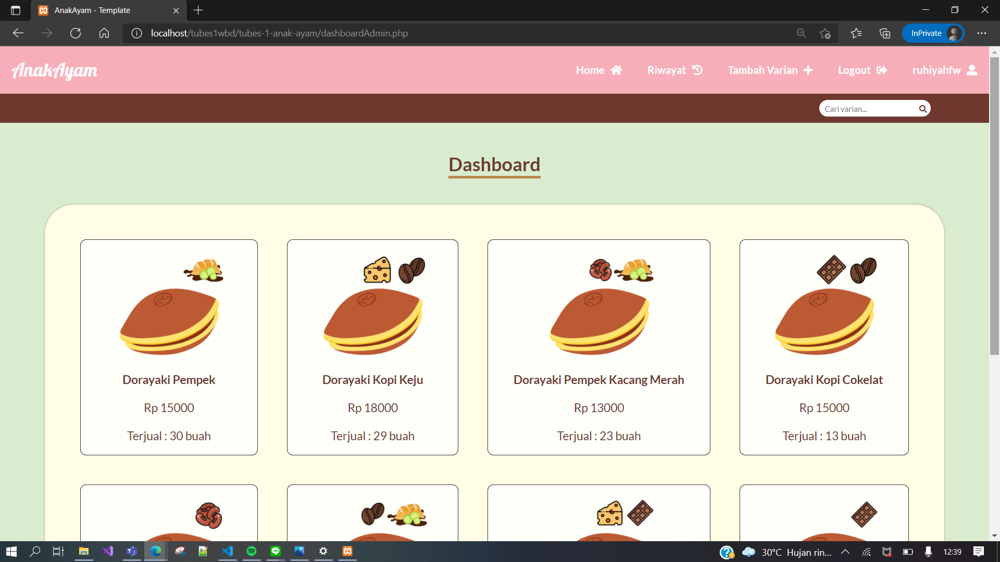

**Dashboard user**
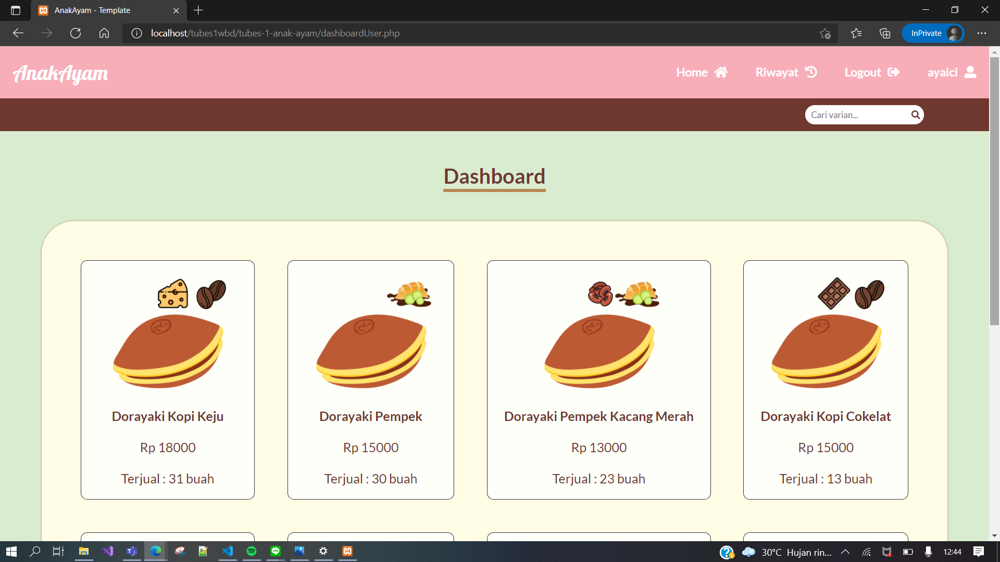

**Detail admin**
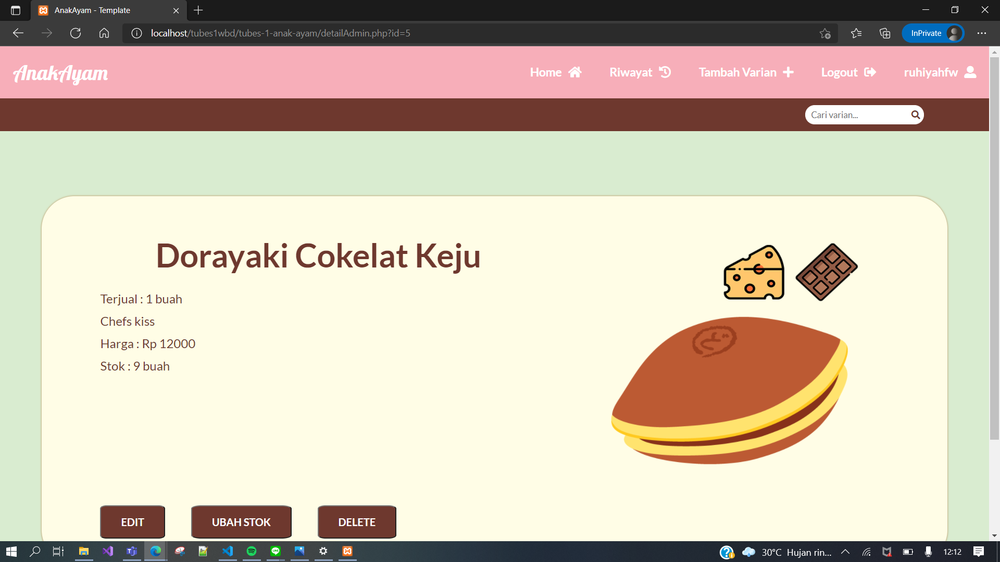

**Detail user**
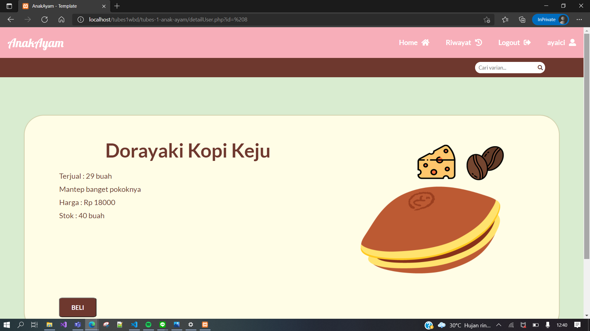

**Hasil Pencarian**
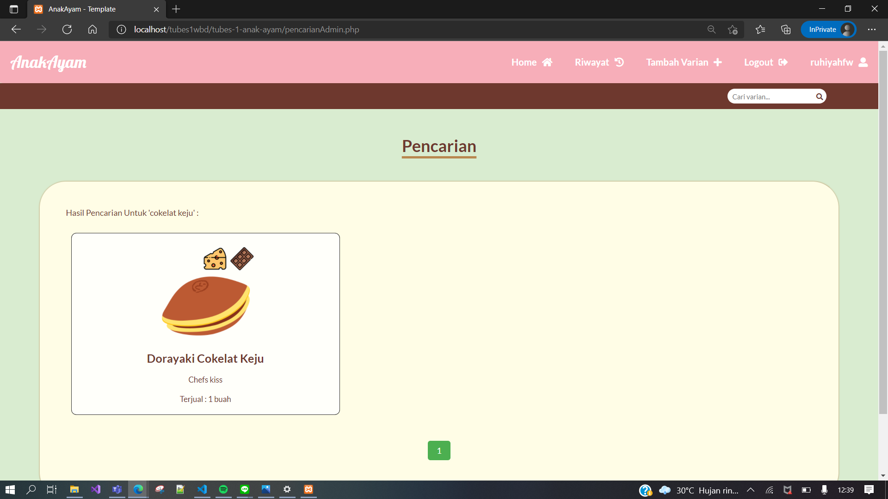

**Penambahan varian**
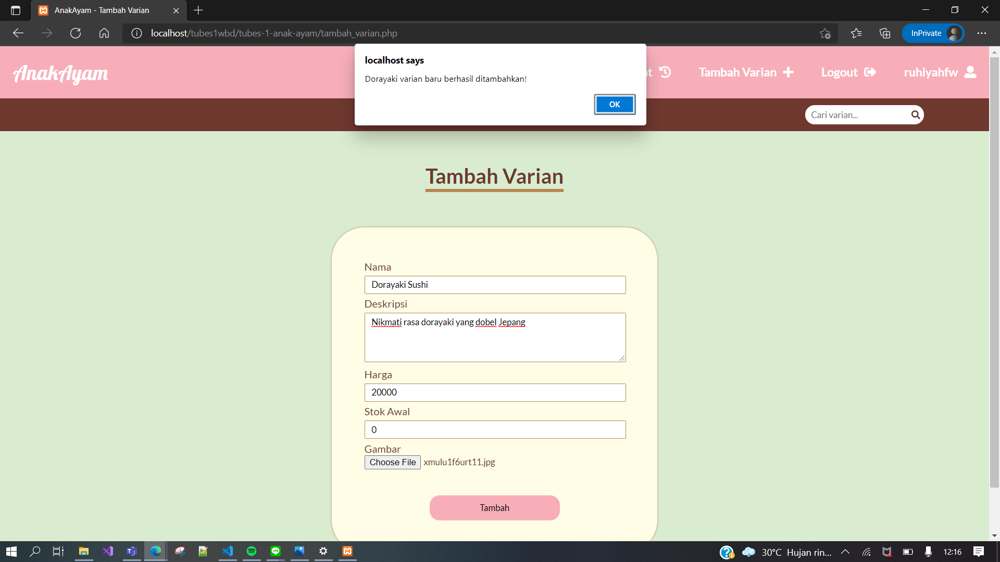

**Pembelian**
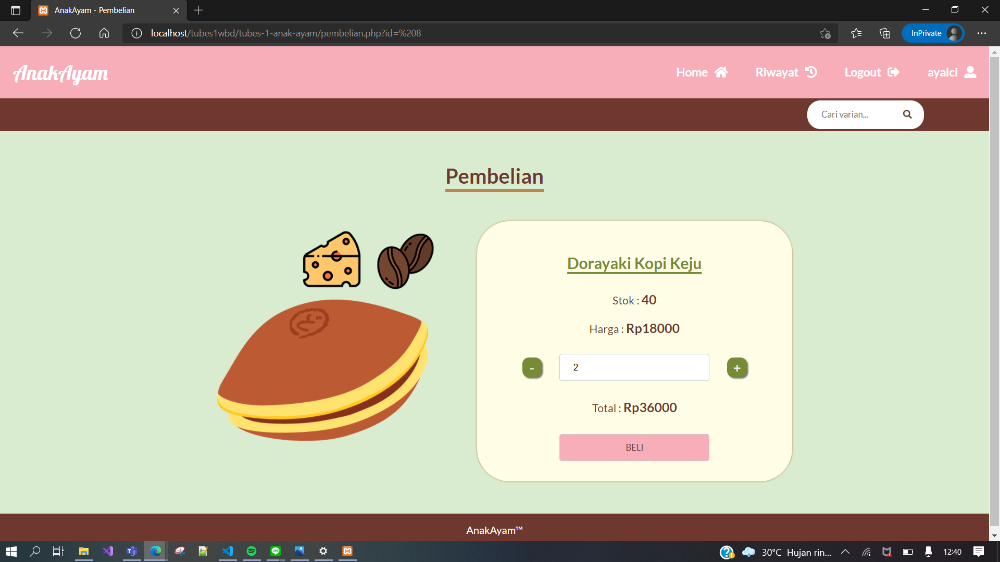

**Perubahan stok**
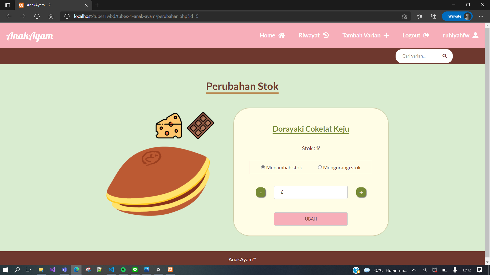

**Riwayat pengubahan stok**
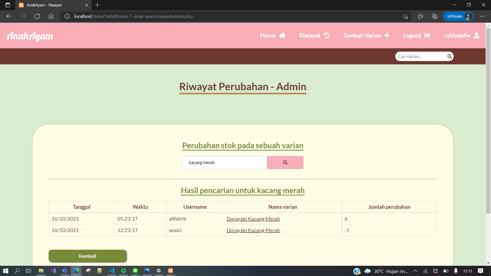

**Riwayat pembelian dorayaki**
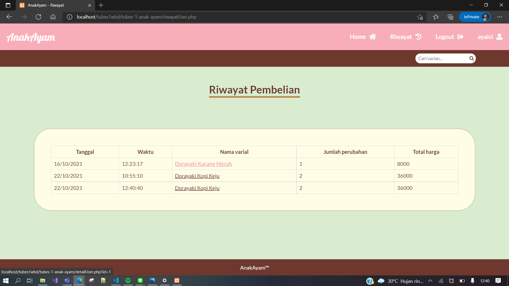

**Penghapusan varian varian**
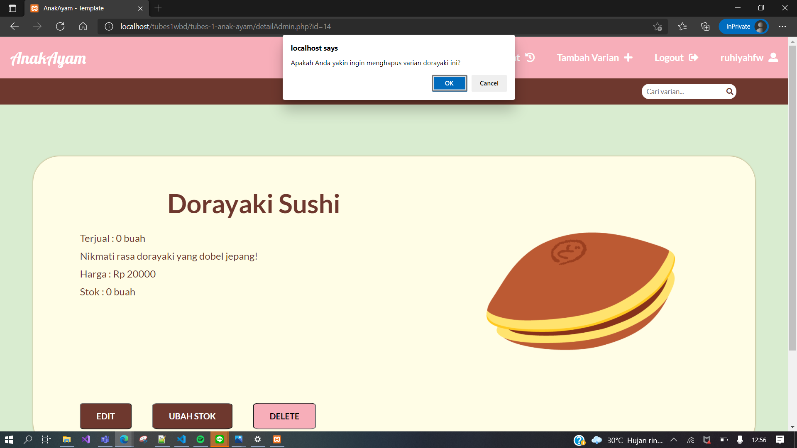

